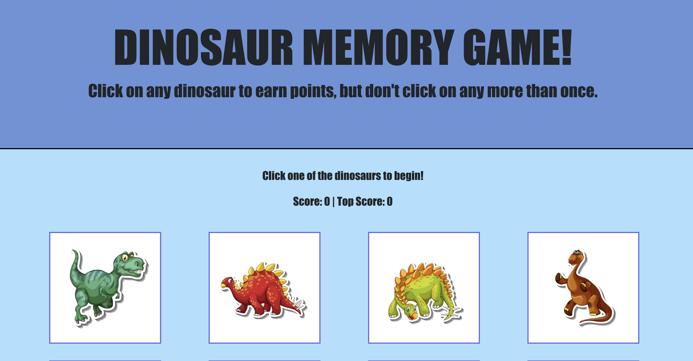

---
### Dinosaur Memory Game
https://925work.github.io/react-memory-game/
Click on any dinosaur to earn points, but don't click on any more than once. When an image is clicked, all images will shuffle, so don't forget which one you clicked!

---
### Project Goals
* Use REACT and Bootstrap to create a game.
* Store images clicked in state.
* Check if an image was clicked twice.
* Lose and restart if the image is clicked twice.
* Shuffle images after once is clicked.

---
### Technology Used
* HTML | CSS | Javascript
* [Bootstrap](https://getbootstrap.com/)
* [React JS](https://reactjs.org/)

---
### © 2019 Built By

Alexander Pham | [GitHub](https://github.com/925work) |  [LinkedIn](https://www.linkedin.com/in/alexanderpham626/)
